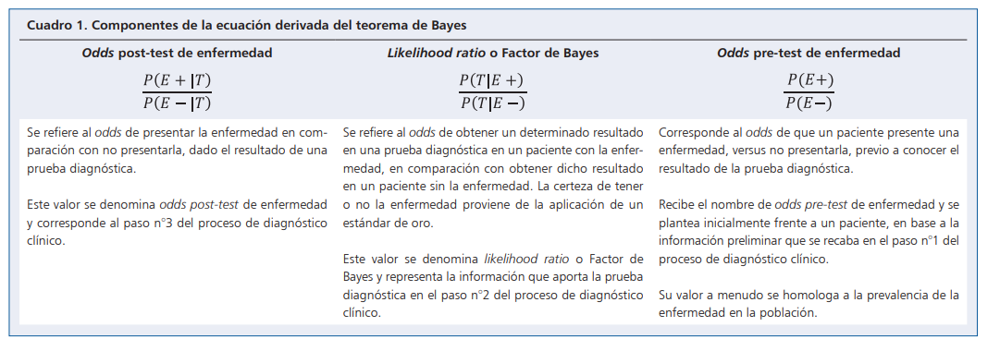
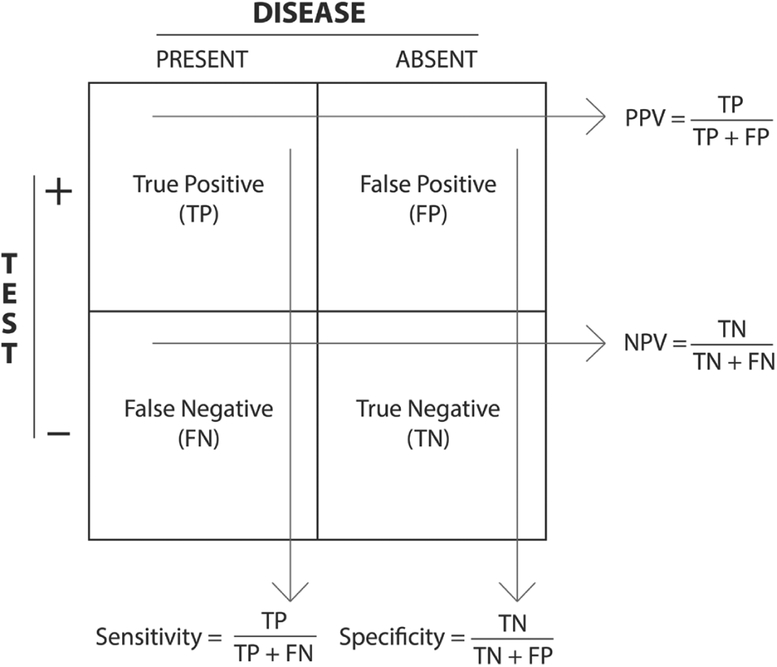

------------------------------------------------------------------------

------------------------------------------------------------------------

# Bitácora #1 {.unnumbered .unlisted}

## Audiencia del proyecto {.unnumbered .unlisted}

"Esta semana, le diría a un actuario de seguros médico o de vida que las enfermedades cardiovasculares representan uno de los riesgos más significativos que enfrenta su cartera de asegurados, y que contar con un análisis estadístico riguroso de sus factores predictores podría mejorar la precisión en la estimación de primas y la gestión del riesgo."

La audiencia de este proyecto es el actuario especializado en seguros de vida o seguros de salud. Las enfermedades cardíacas constituyen una de las principales causas de mortalidad a nivel mundial, lo que las convierte en un factor determinante al momento de estimar el riesgo de vida de un asegurado. Al identificar qué características clínicas y físicas están más asociadas con la presencia de enfermedades cardiovasculares, un actuario puede incorporar esa información al proceso de suscripción y tarifación: ajustar la prima según el perfil de riesgo del cliente, establecer exclusiones pertinentes o diseñar productos más precisos. Este proyecto busca, entonces, proveerle a ese profesional una base estadística que respalde sus decisiones con evidencia.

## Posicionamiento del equipo {.unnumbered .unlisted}

El equipo está conformado por estudiantes de Ciencias Actuariales, se aborda este proyecto desde una perspectiva directamente alineada con su aplicación profesional, la gestión del riesgo en seguros de vida y salud. Un integrante cuenta con experiencia en pasantía desarrollando aplicaciones de visualización de datos con Shiny usando información real de la Superintendencia de Pensiones, lo que aporta familiaridad con datos institucionales y herramientas de análisis en R. Otro integrante se desempeña en una operadora de pensiones complementarias, liderando análisis financiero y de datos aplicado a la evaluación de instrumentos y vehículos de inversión. Su trabajo integra modelación cuantitativa, análisis cualitativo y desarrollo de soluciones analíticas, lo que le permite generar insights sobre el comportamiento de los activos y mantener un vínculo directo con el entorno financiero regulado costarricense. Estas experiencias, combinadas con la formación actuarial compartida por todos los integrantes, nos posicionan para abordar este problema desde una perspectiva tanto técnica como aplicada.

# Planificación

## Pregunta de investigación

### Definición de la idea

Idea: **"Se quiere identificar las características en las personas que más influyen en enfermedades cardíacas**

### Conceptualización de la idea

De la idea anterior, se definen las palabras clave según la @RAE:

**Característica:** Cualidad que da carácter o sirve para distinguir a alguien o algo de sus semejantes.

**Influir:** Dicho de una cosa: Producir sobre otra ciertos efectos; como el hierro sobre la aguja imantada, la luz sobre la vegetación, etc.

Además, se define según la @WHF:

**Enfermedades Cardiovasculares:** Enfermedades que afectan al corazón o a los vasos sanguíneos (venas y arterias). Pueden estar causadas por una combinación de factores de riesgo socioeconómicos, conductuales y ambientales, como hipertensión arterial, dieta poco saludable, colesterol alto, diabetes, contaminación atmosférica, obesidad, tabaquismo, enfermedades renales, inactividad física, consumo nocivo de alcohol y estrés. *Los antecedentes familiares, el origen étnico, el sexo y la edad* también pueden afectar al riesgo de enfermedad cardiovascular de una persona.

### Identificación de tensiones

1. Puede que el tamaño de la muestra no sen suficiente para concluir estadísticamente acerca de la influencia de ciertas variables en la presencia de enfermedades cardíacas. 
2.Es posible que los valores de las variables estén muy dispersos y no se note una clara distinción en cuál variable influye realmente en tener la la presencia de alguna enfermedad cardíaca. 
3. Según la WHF, son variables relevantes los antecedentes familiares y el origen étnico al momento de evaluar la posibilidad de tener problemas cardíacos, la ausencia de estas variables en el *dataset* limita el alcance explicativo del análisis. 

### Reformulación de la idea en forma de pregunta

1.  ¿Qué importancia tiene conocer la influencia de ciertas características de personas en enfermedades cardíacas?
2.  ¿Cómo influyen ciertas características de personas en enfermedades cardíacas?
3.  ¿Cuáles son las características en personas que más influyen en enfermedades cardíacas?
4.  ¿Qué patrones presentan estas características en personas con y sin enfermedades cardíacas?

Se descarta la pregunta 1, pues la importancia es muy bien conocida, pues al conocer dichas características se puede prevenir la presencia de enfermedades cardiovasculares, además de que dicha importancia no se puede medir con los datos encontrados. De igual forma con la pregunta 2 con los mismos datos no es posible entender exactamente cómo influyen estas características en la aparición de estas enfermedades, por lo que se descarta su estudio. Finalmente se descarta la pregunta 4, pues se requieren de muchas herramientas fuera del alcance del curso para analizar completamente los patrones que existen en los datos utilizados, por lo que se decide trabajar con la pregunta 3, además de que esta última pregunta explica mejor la idea inicialmente expuesta.

### Argumentación de la pregunta
***Pregunta 1**
¿Qué importancia tiene conocer la influencia de ciertas características de personas en enfermedades cardíacas?

### Contraargumentos

**Lógica:**  
Conocer la importancia de estas características no necesariamente implica poder predecir o prevenir la enfermedad, ya que pueden existir variables ocultas o factores no medidos en el *dataset*.

**Ética:**  
El uso de datos médicos puede generar interpretaciones incorrectas si no se consideran contextos clínicos adecuados, lo que podría llevar a conclusiones irresponsables.

**Emocional:**  
La difusión de resultados sobre factores de riesgo puede generar ansiedad en las personas si se interpretan como determinantes absolutos de la enfermedad.

#### Argumentos

**Lógica:**  
El análisis de variables como edad, colesterol y presión arterial permite identificar patrones asociados a enfermedades cardíacas, lo cual es fundamental en estudios poblacionales de la salud.

**Ética:**  
Trabajar con datos anónimos y públicos permite realizar análisis responsables sin comprometer la privacidad de las personas.

**Emocional:**  
El conocimiento de factores de riesgo puede benerficiar a las personas para adoptar hábitos más saludables y tomar decisiones informadas sobre su salud.

#### Conclusión

Conocer la influencia de ciertas características en enfermedades cardíacas es fundamental para la prevención y comprensión del problema. Aunque existen limitaciones en los datos y posibles interpretaciones erróneas, el valor informativo de este análisis justifica su estudio, especialmente en contextos donde la prevención es clave.

**Pregunta 2**

¿Cómo influyen ciertas características de personas en enfermedades cardíacas?

#### Contraargumentos

**Lógica:**  
Los datos disponibles permiten identificar correlaciones, pero no necesariamente relaciones causales, lo que limita la interpretación de cómo influyen realmente las variables.

**Ética:**  
La simplificación de la influencia de variables podría llevar a conclusiones reduccionistas, ignorando factores sociales, genéticos o ambientales no incluidos en el *dataset*, por la diversidad de posibilidades.

**Emocional:**  
Las personas podrían asumir que ciertas características determinan su condición de salud, lo que puede generar fatalismo o decisiones equivocadas.

#### Argumentos

**Lógica:**  
A través de métodos estadísticos como regresión o análisis de correlación, es posible identificar el grado de asociación entre variables y la presencia de enfermedades cardíacas.

**Ética:**  
El uso de datos estructurados y documentados permite realizar análisis transparentes y replicables, garantizando la integridad del estudio.

**Emocional:**  
Comprender cómo influyen las variables permite comunicar mejor los riesgos y fomentar cambios positivos en el estilo de vida de las personas.

#### Conclusión

Si bien los datos no permiten establecer causalidad directa, sí es posible analizar cómo influyen ciertas características en enfermedades cardíacas mediante relaciones estadísticas. Este enfoque aporta valor al entendimiento del problema, siempre que se interprete con cautela y dentro de sus limitaciones.

**Pregunta 3**
¿Cuáles son las características en personas que más influyen en enfermedades cardíacas?

#### Contraargumentos

**Lógica:**  
La identificación de las características más influyentes depende del método utilizado, lo que puede generar resultados distintos y dificultar determinar cuáles variables son realmente las más relevantes.

**Ética:**  
El *dataset* puede no ser representativo de toda la población, lo que introduce sesgos en los resultados.

**Emocional:**  
Las personas podrían interpretar erróneamente los resultados y generar preocupación innecesaria sobre su salud.

#### Argumentos

**Lógica:**  
Mediante análisis estadísticos como correlación y modelos de clasificación, es posible identificar variables con mayor peso en la predicción de enfermedades cardíacas de acuerdo a los datos.

**Ética:**  
El uso de datos públicos y anónimos provenientes de sitios conocidos por ser usados para bases de datos, como es el caso de kaggle, garantiza que no se vulnera la privacidad de los individuos.

**Emocional:**  
El análisis puede contribuir a la concientización sobre factores de riesgo y promover hábitos saludables.

#### Conclusión

El análisis de las características más influyentes en enfermedades cardíacas es viable mediante herramientas estadísticas y de aprendizaje automático. Sin embargo, los resultados deben interpretarse con cautela debido a posibles sesgos y a la naturaleza no causal de los datos. Aun así, este estudio puede aportar valor en la identificación de factores de riesgo relevantes.

**Pregunta 4**

¿Qué patrones presentan estas características en personas con y sin enfermedades cardíacas?

#### Contraargumentos

**Lógica:**
El análisis de patrones puede verse limitado por la dispersión de los datos, lo que dificulta identificar diferencias claras entre personas con y sin enfermedades cardíacas.

**Ética:**
El *dataset* no incluye todas las variables relevantes (como antecedentes familiares o factores genéticos), lo que puede generar interpretaciones incompletas o sesgadas.

**Emocional:**
Las personas podrían interpretar los patrones como determinantes absolutos de su salud, generando preocupación innecesaria o conclusiones erróneas.

#### Argumentos

**Lógica:**
El *dataset* permite dividir la población en dos grupos (con y sin enfermedad cardiovascular) y analizar diferencias en variables como edad, presión arterial, colesterol y hábitos de vida, lo que facilita la identificación de patrones característicos en cada grupo.

**Ética:**
El uso de datos anónimos y públicos permite realizar análisis responsables sin comprometer la privacidad de los individuos, siempre que se interpreten los resultados con cautela.

**Emocional:**
Identificar patrones puede ayudar a generar conciencia sobre factores asociados a enfermedades cardíacas, incentivando hábitos saludables y una mayor atención a la salud personal.

#### Conclusión

El análisis de patrones entre personas con y sin enfermedades cardíacas es viable con los datos disponibles y aporta una perspectiva descriptiva importante para el proyecto. Aunque existen limitaciones en el *dataset*, este enfoque permite complementar la pregunta principal y contribuir al entendimiento del problema desde un análisis exploratorio.

### Argumentación a través de datos

El conjunto de datos utilizado en este proyecto corresponde a un *dataset* clínico orientado
al estudio de enfermedades cardiovasculares, conocido como **"Cardiovascular Disease *dataset*"
(cardio_train.csv)**. Este tipo de información es ampliamente utilizado en estudios estadísticos
y de aprendizaje automático para analizar factores de riesgo asociados a condiciones cardíacas.

#### Fuente de los datos

El *dataset* proviene de una base de datos pública disponible en la plataforma Kaggle por @Ulianova construida a partir de registros médicos anónimos. Su uso es frecuente en contextos
académicos debido a la variedad de variables clínicas y de estilo de vida que contiene.

#### Contexto temporal y espacial

El *dataset* no especifica de manera explícita el periodo de recolección ni la ubicación
geográfica exacta de los pacientes. Esta limitación tiene implicaciones directas para nuestra
pregunta de investigación: los factores de riesgo cardiovascular pueden variar significativamente
entre poblaciones de distintas regiones geográficas y épocas, por lo que los patrones
identificados en este *dataset* podrían no generalizarse a otras poblaciones. En consecuencia,
los resultados del análisis deben interpretarse como asociaciones válidas dentro del contexto
de esta muestra específica, sin asumir representatividad global. Se asume que los datos
provienen de un entorno clínico estructurado, lo que garantiza cierta consistencia en las
mediciones.

#### Facilidad de obtención de la información

El *dataset* es de acceso público y gratuito, disponible en la plataforma Kaggle. Puede
descargarse directamente en formato CSV, lo que facilita su manipulación en herramientas
estadísticas como R o Python. No requiere permisos especiales ni procesos complejos de
adquisición.

#### Población de estudio

La población corresponde a pacientes adultos evaluados mediante diferentes mediciones
clínicas. No se cuenta con información específica del país o institución de origen, pero se
asume que los datos provienen de un entorno médico controlado.

#### Muestra observada

El conjunto de datos está compuesto por aproximadamente 70,000 registros de pacientes.
Cada uno corresponde a una observación individual, lo que permite trabajar con un tamaño
de muestra suficientemente grande para realizar análisis estadísticos confiables.

#### Unidad estadística

La unidad estadística es cada paciente individual registrado en el *dataset*. Cada fila
representa una observación independiente con sus respectivas características médicas y hábitos.

#### Estructura de la tabla de datos

Cada fila del *dataset* representa un paciente individual. Cada columna corresponde a una
variable específica que describe alguna característica del paciente, ya sea demográfica,
fisiológica, bioquímica o de comportamiento. Cada celda contiene el valor observado de esa
variable para un paciente determinado. Por ejemplo, la celda en la columna de presión
arterial sistólica para una fila dada indica la medición exacta de ese paciente en ese
indicador, lo cual es uno de los valores que el modelo utilizará para determinar si ese
paciente presenta o no enfermedad cardiovascular.

#### Variables del *dataset* y su relación con la pregunta de investigación

El conjunto de datos incluye variables tanto cuantitativas como cualitativas. A continuación
se describen y se explica su relevancia para la pregunta de investigación.

**Variables demográficas:**

- *Edad (en días):* Representa la edad del paciente al momento del registro. Para el
  análisis se transformará a años dividiendo entre 365, lo cual facilita la interpretación.
  La edad es un factor de riesgo cardiovascular ampliamente documentado: a mayor edad,
  mayor probabilidad de desarrollar enfermedades del corazón, por lo que esta variable es
  central en nuestro argumento.

- *Género:* Variable categórica que permite explorar si existen diferencias estadísticamente
  significativas en la prevalencia de enfermedades cardiovasculares entre hombres y mujeres,
  lo cual es relevante para caracterizar la población en riesgo.

**Variables fisiológicas:**

- *Altura y peso:* Permiten calcular el Índice de Masa Corporal (IMC), un indicador del
  estado nutricional del paciente. El sobrepeso y la obesidad son factores de riesgo
  cardiovascular reconocidos, por lo que estas variables contribuyen directamente a
  argumentar la relación entre composición corporal y enfermedad.

- *Presión arterial sistólica y diastólica:* Son variables centrales para el análisis.
  La hipertensión es uno de los factores de riesgo cardiovascular más documentados en la
  literatura médica. Su presencia en el *dataset* permite explorar directamente la asociación
  estadística entre niveles de presión arterial y la variable respuesta.

**Variables bioquímicas:**

- *Nivel de colesterol:* Variable categórica ordinal (normal, por encima de lo normal, muy
  por encima de lo normal). El colesterol elevado está asociado a la acumulación de placas
  en las arterias, lo que incrementa el riesgo de enfermedades cardiovasculares. Esta
  variable permite argumentar el efecto de los marcadores bioquímicos en el diagnóstico.

- *Nivel de glucosa:* Similar al colesterol, permite explorar la relación entre niveles de
  azúcar en sangre y la presencia de enfermedad cardiovascular, lo cual es especialmente
  relevante considerando la asociación entre diabetes y riesgo cardíaco.

**Variables de comportamiento:**

- *Consumo de alcohol, hábito de fumar y nivel de actividad física:* Estas variables
  categóricas binarias capturan los hábitos de vida del paciente. Su inclusión permite
  argumentar que los factores de estilo de vida, además de los fisiológicos y bioquímicos,
  tienen un rol en la probabilidad de desarrollar enfermedades cardiovasculares. Son
  variables que conectan emocionalmente con el lector, ya que representan decisiones que
  cualquier persona puede modificar.

**Variable respuesta:**

- *Presencia o ausencia de enfermedad cardiovascular:* Variable binaria (0 = ausencia,
  1 = presencia). Es la variable que se busca explicar y predecir a partir de todas las
  anteriores. Su naturaleza dicotómica determina el tipo de técnicas estadísticas a aplicar,
  como regresión logística u otros modelos de clasificación.

#### Naturaleza de los datos

Los datos son de tipo **observacional**, ya que no provienen de un experimento controlado
sino de registros existentes. Esto implica que las relaciones encontradas entre variables
deben interpretarse como asociaciones y no necesariamente como causalidad. El *dataset*
contiene variables discretas, continuas y categóricas, lo cual lo hace adecuado para
aplicar diversas técnicas estadísticas vistas en el curso.

#### Relevancia para el proyecto

Este *dataset* es pertinente porque permite analizar de forma integral cómo factores
demográficos, fisiológicos, bioquímicos y de comportamiento se asocian con la probabilidad
de desarrollar enfermedades cardiovasculares. La diversidad de variables facilita abordar
la pregunta de investigación desde múltiples ángulos, aplicando herramientas como análisis
descriptivo, exploración de relaciones entre variables y modelado predictivo, alineándose
directamente con los objetivos del curso.

## Revisión bibliográfica

Sobre el tema de los problemas cardiovasculares en el ambiente de la estadística se ha escrito una gran cantidad de artículos. Entre ellos, uno de los más destacados es la obra de @Gill *Why Clinitians are natural Bayesians*; que a pesar de la edad del artículo, provee detalles de por qué el enfoque bayesianoes mejor usarse en lugar del enfoque clásico. De acuerdo a @Gill "El enfoque bayesiano no devuelve una respuesta de sí o no, sino una probabilidad condicional que refleja el contexto en el que el se hace la prueba". Por lo tanto, el enfoque bayesiano tiene la ventaja de que el contexto cambia las conclusiones que se pueden extraer para los datos. La diferencia entre estos dos se va a profundizar aún más en el marco teórico de esta investigación, pero este artículo es fundamental para comprender por qué se usa el enfoque bayesiano sobre el clásico o frecuentista.

Además de este artículo, hay más que explican por qué se prefiere el enfoque bayesiano para datos como estos. Entre estos, el articulo de @Lorca *Inferencia Bayesiana en el proceso de diagnóstico clínico:
un enfoque docente para la toma de decisiones* es una obra mucho más reciente que la anterior, en particular algo llamativo es su metodología, pues usan una modificación del Teorema de Bayes:

El uso del factor de Bayes como un cociente de probabilidades condicionales entre eventos similares pero opuestos en cómo se condicionan provee información importante para la metodología que se podrá usar en la investigación.

Otro artículo que es similar al anterior es *Una pequeña mirada a la estadística bayesiana en el análisis de datos cardiológicos* por @Armero. Esto se da gracias a que la metodología de este también hace uso del teorema de Bayes para construir un factor de Bayes. En particular, además demuestra como se puede incorporar información de estudios previos y manejar muestras pequeñas o datos complejos, lo cual es una tendencia común en otros artículos referenciados en esta sección.

*The Information Theoretic Perspective on Medical Diagnostic Inference* por @Eiseman, donde se provee una tabla útil para ver cómo definieron su factor de Bayes 

El factor de Bayes en este caso varía un poco comparado a los otros pero la idea general se basa en tomar una probabilidad basada en el Teorema de Bayes, usando ocurrencias falsas y verdaderas del padecimiento. Este enfoque complementa la estadística bayesiana al medir cuánta "información" aporta realmente un biomarcador o un signo clínico en el proceso diagnóstico.

El factor de Bayes como metodología se cubre también ampliamente en la obra de @Ramos *El uso del factor Bayes en la investigación clínica de cardiología*. En particular, empieza explicando por qué el factor de bayes es usado en la cardiología. Pues, como indica las investigaciónes clínicas ocupan evidencia con la mayor credibilidad posible, pero se complica por la poca cantidad de eventos. En su caso, usan el factor de Bayes como una probabilidad de los datos frente una hipóteis nula frente a hipótesis alternativa. Resumido, considera que el Factor de Bayes permite conclusiones más sólidas en los estudios de cardiología.

Aparte de aplicaciones directas de la estadística para la cardiología, también hay artículos que se basan en modelos predictivos. El más reciente de este es el artículo de @Kaufmann *A Bayesian Network Analysis of the Diagnostic Process and its Accuracy to Determine How Clinicians Estimate Cardiac Function in Critically Ill Patients: Prospective Observational Cohort Study*. En este artículo definien una función que dependen de probabilidades condicionales, cuyas condiciones en sí son dependientes de varios factores de riesgo. Lo particular de este artículo es su uso de redes bayesianes. Realiza un estudio de cohorte prospectivo utilizando redes bayesianas para modelar cómo los médicos estiman la función cardíaca en pacientes críticos. El estudio identifica dependencias clave, como el uso de noradrenalina y el llenado capilar, revelando que el juicio clínico a menudo es poco preciso y puede mejorarse mediante herramientas digitales de entrenamiento basadas en probabilidades.

Siguiendo con el tema de modelos predictivos, la obra de @Damen *Prediction models for cardiovascular disease risk in the general population: systematic review* se destaca entre las otras pues se enfoca menos en el ámbito teórico y empieza a aplicarlo a datos reales; en particular, más de 100 modelos. En los modelos analizados en el estudio, los más importantes fueron sexo: que se incluyeron en 24% de los estudios pero 88% de esos modelos se enfocaron en solo uno de los sexos. 66% de esos incluyeron predictores que consistían edad, fumador, presión de sangre y colesterol. 52%  incluían diabetes, 29% incluían índice de masa corporal y sólamente 15% incluían el uso de tratamiento (ie drogas contra hypertension, etc.). Una limitación de este artículo, a pesar de su gran versatilidad es la alta variabilidad de muestras, con un mínimo de 51 en un modelo y un máximo de 1.189.845 en otro (mediana de 3969). Además, la cantidad de eventos también varía mucho: de 28 a 55.667. Critica la proliferación de nuevos modelos que a menudo carecen de validación externa y resalta la importancia de la metodología estadística rigurosa para asegurar que estas herramientas sean útiles y no introduzcan sesgos en la prevención cardiovascular

*Cardiología "basada en la evidencia": aplicaciones prácticas de la epidemiología. IV. Modelos de predicción de riesgo cardiovascular* por @Rodriguez provee otro punto de vista en los modelos predictivos. En particular, considera el factor de riesgo más importante como la edad. Esto es gracias a que la supervivencia edad en sí sigue una distribución exponencial, entonces el riesgo cardiovascular también se ve afectado. El segundo factor de riesgo, es el sexo por razones similares a la edad, el hombre tiende a tener una expectativa de vida menor a la mujer. Para ilustrar esto, compara un caso de una mujer de 50 años y un hombre de 50 años. Analiza cómo las variables estadísticas se transforman en herramientas de puntuación clínica para predecir eventos futuros, subrayando la necesidad de que estos modelos se adapten a las poblaciones específicas donde se aplican  

Finalmente, para complementar la bibliografía existente, se van a utilizar varias obras para definir conceptos teóricos centrales a la investigación. Para explicar la diferencia entre inferencia bayesiana y clásica, la obra de @Pek *Frequentist and Bayesian approaches to  to data analysis: Evaluation and estimation*. Esta explica la diferencia entre ambos con simplicidad, pero también provee ejemplos que ilustran cómo diferentes conclusiones se pueden extraer de los mismos datos a partir de los dos enfoques. Para conceptos de estadística, el libro de @Degroot *Probability & Statistics* provee definiciones amplias para conceptos necesarios para explicar la inferencia bayesiana y clásica.

## Ficha de Literatura 1

### Nivel descriptivo

**Título:** Cardiovascular Disease Risk Assessment: Insights from Framingham

**Autor(es):** Agostino, R. B. Sr.; Pencina, M. J.; Massaro, J. M.; Coady, S.

**Año:** 2013

**Nombre del tema:** Desarrollo, evaluación y validación de funciones multivariables
de riesgo cardiovascular derivadas del Estudio Framingham.

**Clasificación:** *Metodológica* — se eligió esta etiqueta porque el documento se
centra en los métodos estadísticos (modelo de Cox, calibración, discriminación) para
construir y validar modelos de predicción, y no en describir el fenómeno cardiovascular
en sí (temática), en ordenar el conocimiento históricamente (cronológica) ni en
proponer un marco conceptual nuevo (teórica).

**Resumen en una oración:** Funciones multivariables de Framingham estiman riesgo
cardiovascular combinando factores clínicos mediante modelos estadísticos.

**Argumento central:** La enfermedad cardiovascular es multifactorial, por lo que
ningún factor de riesgo aislado es suficiente para evaluarla. Las Framingham Risk
Functions combinan variables como edad, presión arterial sistólica, colesterol total,
colesterol HDL, tabaquismo y diabetes en un modelo de Cox que produce estimaciones de
riesgo absoluto a 10 años, con buena discriminación (C-estadístico entre 0.79 y 0.83)
y calibración tanto en la muestra original como en poblaciones externas tras
recalibración.

**Problemas con el argumento o el tema:** Los autores reconocen que las funciones
fueron desarrolladas en una población blanca de clase media de Massachusetts, lo que
limita su generalización directa a otras etnias o regiones; en poblaciones asiáticas e
hispanas el modelo sobreestima el riesgo sin recalibración previa. Además, una vez que
el C-estadístico supera 0.75 es matemáticamente muy difícil mejorarlo añadiendo nuevos
biomarcadores, lo que representa un techo de predicción inherente a estos modelos.

---

### Nivel analítico

**Conexión con mi proyecto:** Este artículo respalda directamente nuestra pregunta de
investigación porque valida el uso de variables como presión arterial sistólica,
colesterol, glucosa, tabaquismo y edad —todas presentes en nuestro *dataset*
`cardio_train.csv`— como predictores relevantes de enfermedad cardiovascular. Además,
justifica metodológicamente el uso de regresión logística y modelos de clasificación
binaria sobre nuestra variable respuesta binaria (presencia/ausencia de ECV), y provee
criterios concretos para evaluar su desempeño: el C-estadístico y el test de
calibración de Nam-D'Agostino.

**Lo que NO dice el autor:** El artículo no aborda el rendimiento predictivo cuando se
incluyen variables de comportamiento como consumo de alcohol o nivel de actividad
física junto a los marcadores clínicos clásicos, dimensión que nuestro *dataset* sí
permite explorar. Tampoco discute el impacto de trabajar con datos sin contexto
geográfico definido, limitación que afecta directamente a `cardio_train.csv`.

**Contraste con otra fuente:** Este artículo contrasta productivamente con Damen
et al. (2016): mientras D'Agostino presenta el desarrollo y validación exitosa de
un modelo específico (Framingham), Damen et al. muestran en una revisión de 363
modelos que ese nivel de validación externa es la excepción y no la regla en el
campo. Esto resuelve una pregunta que D'Agostino deja implícita: ¿qué tan
representativo es el caso Framingham del estado general de la predicción
cardiovascular? La respuesta de Damen es que la mayoría de modelos publicados
carecen de validación externa adecuada, lo que refuerza la necesidad de ser
cautelosos al interpretar los resultados de nuestro propio modelo, especialmente
considerando que `cardio_train.csv` no especifica origen geográfico y no permite
una validación externa rigurosa.

**Evaluación de aplicabilidad (4/5):** La metodología del modelo de Cox y la regresión
logística son directamente aplicables a nuestros datos, ya que compartimos las mismas
variables de entrada (presión arterial, colesterol, edad, tabaquismo) y la misma
variable respuesta binaria. Se descuenta un punto porque nuestro *dataset* no incluye
colesterol HDL por separado ni información sobre tratamiento antihipertensivo, variables
que el modelo Framingham considera relevantes para la estimación del riesgo.

**Pregunta que le haría al autor:** ¿Cómo afecta el rendimiento del modelo cuando la
edad está registrada en días en lugar de años y no se dispone de información sobre el
origen geográfico de los pacientes, como ocurre en *datasets* clínicos de acceso público
como `cardio_train.csv`?

**Resumen argumentativo:** El problema que D'Agostino y colaboradores intentan resolver
es cómo combinar múltiples factores de riesgo clínico en una función matemática única
que permita estimar de forma precisa y generalizable la probabilidad individual de
desarrollar enfermedad cardiovascular. La solución propuesta —las Framingham Risk
Functions basadas en el modelo de Cox— funciona bien para nuestro contexto porque las
variables de entrada del modelo original (presión arterial, colesterol, tabaquismo,
edad, glucosa) coinciden casi exactamente con las disponibles en `cardio_train.csv`.
Sin embargo, presenta una limitación relevante: fue desarrollada en una población
geográficamente homogénea, mientras que nuestro *dataset* no especifica el origen de sus
pacientes, lo que introduce incertidumbre sobre la transportabilidad directa de los
coeficientes. A pesar de esto, el elemento que usaremos de este documento es el marco
de evaluación de modelos que propone: adoptaremos el C-estadístico como medida de
discriminación y la comparación entre probabilidades predichas y tasas observadas como
criterio de calibración para juzgar la calidad de los modelos de clasificación que
desarrollaremos sobre la variable respuesta binaria de nuestro *dataset*.

---

## Ficha de Literatura 2

### Nivel descriptivo

**Título:** Prediction models for cardiovascular disease risk in the general
population: systematic review

**Autor(es):** Damen, J. A. A. G.; Hooft, L.; Schuit, E.; Debray, T. P. A.;
Collins, G. S.; Tzoulaki, I.; Lassale, C. M.; Siontis, G. C. M.; Chiocchia, V.;
Roberts, C.; Schlüssel, M. M.; Gerry, S.; Black, J. A.; Heus, P.;
Van der Schouw, Y. T.; Peelen, L. M.; Moons, K. G. M.

**Año:** 2016

**Nombre del tema:** Panorama general del estado del arte en modelos de predicción
de riesgo cardiovascular en población general, con énfasis en sus limitaciones
metodológicas y la falta de validación externa.

**Clasificación:** *Temática* — se eligió esta etiqueta porque el documento no
desarrolla ni aplica un método estadístico concreto (metodológica), no propone un
marco conceptual nuevo (teórica) ni organiza el conocimiento por orden temporal
(cronológica); su propósito es mapear el estado del campo mediante una revisión
sistemática de 363 modelos existentes, lo cual es una contribución temática sobre
el problema de la predicción cardiovascular en su conjunto.

**Resumen en una oración:** Revisión sistemática de 363 modelos de predicción
cardiovascular revela deficiencias generalizadas de validación externa.

**Argumento central:** Existe un exceso de modelos predictivos para riesgo
cardiovascular en la población general, pero la utilidad de la mayoría permanece
incierta debido a deficiencias metodológicas recurrentes: tamaños de muestra
inadecuados, presentación incompleta de los modelos, ausencia de validación externa
y falta de estudios de impacto clínico. Los predictores más frecuentes en los modelos
revisados son edad, sexo, tabaquismo, presión arterial sistólica, colesterol total y
diabetes, lo cual confirma la relevancia de las variables disponibles en *datasets*
clínicos observacionales.

**Problemas con el argumento o el tema:** Los autores reconocen que la revisión cubre
literatura hasta junio de 2013, por lo que no incluye desarrollos metodológicos más
recientes como modelos de machine learning o técnicas de aprendizaje profundo. Además,
la heterogeneidad de los estudios revisados dificulta comparaciones directas entre
modelos, ya que difieren en poblaciones objetivo, definiciones de desenlace y
horizontes temporales de predicción.

---

### Nivel analítico

**Conexión con mi proyecto:** Este artículo contextualiza directamente nuestro
proyecto al mostrar que las variables más frecuentes en modelos de predicción
cardiovascular validados —edad, presión arterial sistólica, colesterol y tabaquismo—
son precisamente las que contiene `cardio_train.csv`. Además, la principal conclusión
del artículo (que la mayoría de modelos carecen de validación externa adecuada) nos
alerta sobre la necesidad de no limitarnos a reportar métricas de exactitud, sino de
incluir también análisis de calibración y, en la medida de lo posible, discutir las
limitaciones de generalización de nuestros modelos.

**Lo que NO dice el autor:** La revisión no aborda *datasets* de acceso público como
`cardio_train.csv` ni discute si modelos entrenados sobre datos sin contexto geográfico
definido pueden considerarse válidos para alguna población específica. Tampoco evalúa
modelos de machine learning, que son los que planeamos comparar en nuestro proyecto,
lo que representa una brecha que trabajos más recientes como Ogunpola et al. (2024)
comienzan a llenar.

**Contraste con otra fuente:** Este artículo complementa a D'Agostino et al. (2013)
desde una perspectiva crítica: mientras Framingham presenta un modelo específico con
buena validación externa como caso de éxito, Damen et al. muestran que ese caso es la
excepción y no la regla — la mayoría de los 363 modelos revisados no alcanza ese
estándar de validación. Esto resuelve una pregunta que D'Agostino deja abierta: ¿qué
tan generalizable es el enfoque Framingham al campo en general? La respuesta de Damen
es que muy pocos modelos logran esa generalización, lo que refuerza la importancia de
ser cautelosos al interpretar los resultados de nuestro propio modelo entrenado sobre
un *dataset* sin origen geográfico definido.

**Evaluación de aplicabilidad (3/5):** La revisión no proporciona una metodología
directamente aplicable a nuestros datos, ya que es un estudio de estudios y no un
modelo predictivo en sí mismo. Sin embargo, su valor para nuestro proyecto es
normativo: establece los criterios mínimos que un modelo de predicción cardiovascular
debería cumplir (reporte completo, validación interna y externa, análisis de
calibración), los cuales usaremos como lista de verificación para evaluar y comunicar
las limitaciones de nuestros propios modelos.

**Pregunta que le haría al autor:** Dado que la mayoría de los modelos revisados
fueron desarrollados en Europa y Norteamérica, ¿cómo afecta la ausencia de
información geográfica en *datasets* como `cardio_train.csv` a la posibilidad de
clasificar o comparar un modelo derivado de ellos con los estándares de validación
que propone esta revisión?

**Resumen argumentativo:** El problema que Damen et al. intentan resolver es la
falta de visibilidad sobre el estado real del campo de predicción de riesgo
cardiovascular: ¿cuántos modelos existen, qué variables usan y qué tan bien están
validados? Su respuesta es que el campo está fragmentado y que la mayoría de los
modelos publicados tienen deficiencias metodológicas que impiden su uso clínico
confiable. Esta conclusión funciona bien para nuestro contexto porque nos advierte
que entrenar un modelo con alta exactitud sobre `cardio_train.csv` no es suficiente:
debemos reportar sus limitaciones de validación con honestidad. Sin embargo, el
artículo no resuelve cómo proceder cuando los datos disponibles no permiten una
validación externa rigurosa, que es precisamente nuestra situación. El elemento que
incorporaremos de este documento es su lista de predictores más frecuentes en modelos
validados (edad, presión arterial, colesterol, tabaquismo, diabetes), que usaremos
para justificar la relevancia de las variables de nuestro *dataset*, y su marco crítico
de evaluación, que adoptaremos para discutir honestamente las limitaciones de
generalización de nuestros resultados.

## Ficha de Literatura 3

### Nivel descriptivo

**Título:** Why clinicians are natural Bayesians

**Autor(es):** Christopher J. Gill, Lora Sabin y Christopher H. Schmid.

**Año:** 2005

**Nombre del tema:** La aplicación intuitiva y formal del teorema de Bayes en el razonamiento del diagnóstico clínico.

**Clasificación:** *Estado de arte* — se eligió pues es una documentación muy temprana del uso del factor de Bayes en la cardiología. Provee una idea esencial que, complementada con otros artículos, define el enfoque bayesiano como útil para la investigación.

**Resumen en una oración:** El artículo demuestra cómo los médicos utilizan intuitivamente el pensamiento probabilístico para diagnosticar pacientes.

**Argumento central:** El proceso diagnóstico no es una deducción binaria, sino una actualización constante de probabilidades donde la experiencia previa (probabilidad pre-test) se combina con nueva evidencia para generar una conclusión clínica.

**Problemas con el argumento o el tema:** Los autores identifican que, aunque los médicos son "bayesianos naturales", a menudo tienen dificultades para realizar cálculos matemáticos precisos bajo presión y pueden verse afectados por sesgos cognitivos al estimar probabilidades subjetivas.

---

### Nivel analítico

**Conexión con mi proyecto:** En particular, este artículo es útil para el objetivo de la investigación. Primero, porque la importancia de conocer la influencia de características en el riesgo cardiovascular depende no de un si o no, sino un espectro de probabilidad; un tema que se observa a lo largo de esta obra, especialmente al principio. Otra relación al tema llega a la interpretación de patrones con los datos, pues el artículo introduce el concepto de verosimilitud (*Likelihood ratio*) para explicar que un patrón (o característica) es útil solo si es significativamente más probable en personas enfermas que en personas sanas. Además, explica que ciertos patrones como positivos falsos que pueden estar presentes en personas sanas, y el análisis bayesiano ayuda a distinguir cuándo un patrón es un "ruido" estadístico o una señal real de patología cardíaca. El tema de los falsos positivos y negativos se observa en otros artículos además de éste.

**Lo que NO dice el autor:** No responde cómo influye y cuánto influyen las carácterísticas, pues es una limitación del artículo es que no es cuantitativo, sino que explica más sobre por qué se usa el factor de Bayes. Por ejemplo, si no se sabe a priori cómo influye el tabaquismo en el corazón, no es posible asignar ese valor numérico que el artículo exige para actualizar nuestra sospecha clínica.

**Contraste con otra fuente:** Se contrasta con D'Agostino et al. pues, similarmente al último, D'Agostino usa metodología del modelo de Cox. Muy rígido comparado a la de Gill et al. que usa el factor de Bayes que es más flexible porque permite al médico ajustar la probabilidad incluso con información incompleta o "ruidosa", combinando su experiencia con los datos del paciente de forma fluida. Gill et al. demuestra el ámbito más realista de cómo se usa la probabilidad en tiempo real mientras que D'Angelo et al demuestra un lado más teórico y predictivo.

**Evaluación de aplicabilidad (4.5/5):** Es muy seguro que el enfoque bayesiano va a ser el enfoque principal de la investigación, pues no sólamente se referencia Gill et al. sobre este tema sino que varias otras obras. No obstante, la simplicidad de éste aporta al desarrollo de la metodología.  

**Pregunta que le haría al autor:**  Después de leer el artículo, es fácil saber por qué son bayesianos los clínicos, pero una pregunta que se puede establecer es: ¿Cuáles son las razones de por qué los clínicos NO son frecuentistas?. Parece un poco obvia a plena vista, pues se puede confundir con "¿Por qué los clínicos NO son frecuentistas?". Sin embargo, esta pregunta brinda otras ideas como la precisión de cáclulos bayesianos contra frecuentistas, entre otros.

**Resumen argumentativo:** El problema que intenta resolver Gill et al. es la brecha entre la teoría estadística formal y la práctica clínica real. Los autores argumentan que los médicos ven a ésta como un conjunto de reglas en lugar de usarlos en todos los diagnósticos en sí. En conjunto, la solución no funciona completamente pues una brecha grande de ésta es la falta de datos específicos y qué características afectan el riesgo de un individuo. Por eso es que se debe complementar con otros artículos para llenar algunos de estos huecos en el conocimiento para el proyecto. Sin embargo, si provee una ventana a lo que se ha escrito de la estadística y los problemas médicos, además de metodología y conceptos útiles como el uso de la verosimilitud y factor de bayes para diagnósticos.

---

## UVE de Gowin

{#fig-uve width="90%" fig-align="center"}

## Parte de escritura

## Arco narrativo del proyecto

"El problema que nadie ha resuelto completamente aún es identificar con claridad cuáles características individuales tienen mayor influencia en las enfermedades cardíacas a partir de los datos"

## Diario de aprendizaje

Como equipo, hemos aprendido que el análisis de datos no comienza con la aplicación de métodos, sino con la correcta formulación de una pregunta de investigación alineada con los datos disponibles y de esta forma tener claro cual camino seguir. Al inicio no teníamos claro cómo delimitar una idea en un problema investigable, pero ahora entendemos la importancia de estructurar el enfoque del proyecto desde etapas tempranas, para asi que el flujo de trabajo vaya en la mejor forma. También comprendimos que los datos observacionales no permiten establecer relaciones causales, sino asociaciones, lo que influye directamente en la interpretación de los resultados. Además, identificamos que las limitaciones del *dataset* condicionan el alcance del análisis. Finalmente, aprendimos que la toma de decisiones es un proceso clave que impacta el desarrollo del proyecto, ya que debido a esto se define cómo se analiza la información y qué conclusiones se pueden obtener.

## Rastro de decisiones

### Decisión 1: Uso del *dataset*

- Opciones consideradas:
  - Buscar múltiples *datasets*
  - Utilizar un único *dataset* de Kaggle

- Opción elegida:
  - *dataset* de Kaggle sobre enfermedades cardíacas

- Opciones descartadas:
  - Integración de múltiples fuentes de datos

- Justificación:
  - El *dataset* de Kaggle es accesible, estructurado y contiene variables relevantes para el análisis, lo que permite avanzar de forma eficiente sin necesidad de procesos complejos de integración de datos, además de ser proveniente de una fuente confiable y de uso sencillo y un tema adecuado.

### Decisión 2: Enfoque del proyecto

- Opciones consideradas:
  - Construir un modelo predictivo de enfermedades cardíacas
  - Analizar la relación entre variables y la enfermedad

- Opción elegida:
  - Análisis de la relación entre características y enfermedades cardíacas

- Opciones descartadas:
  - Modelo predictivo completo

- Justificación:
  - El desarrollo de modelos predictivos requiere herramientas y conocimientos más avanzados (machine learning) que no son parte del curso. Por ello, y recomendacion del profesor, se decidió enfocarse en un análisis exploratorio y descriptivo que permita identificar relaciones relevantes entre variables.

### Decisión 3: Selección de la pregunta de investigación

- Opciones consideradas:
  - ¿Qué importancia tiene conocer estas características?
  - ¿Cómo influyen estas características?
  - ¿Cuáles características influyen más?
  - ¿Qué patrones presentan estas características?

- Opción elegida:
  - ¿Cuáles son las características en personas que más influyen en enfermedades cardíacas?

- Opciones descartadas:
  - Preguntas demasiado generales o conceptuales

- Justificación:
  - La pregunta seleccionada permite un análisis directo con los datos disponibles, facilitando la identificación de variables relevantes mediante métodos estadísticos, además de ser la que nos sonó mas acertada.

## Registro de uso de IA

### Preguntas de lógica, ética y emocional

Herramienta: ChatGPT Plus

Prompt: “Ayúdame a elaborar argumentos y contraargumentos para preguntas de lógica, ética y emoción, de manera que pueda identificar qué tipo de respuesta corresponde a cada elemento y luego adaptarlas a un tono más natural y comprensible.”

Respuesta de la IA: La herramienta generó propuestas de argumentos y contraargumentos para cada una de las dimensiones solicitadas: lógica, ética y emocional. Estas respuestas sirvieron como guía inicial para reconocer la estructura esperada en cada tipo de argumentación y diferenciar el enfoque adecuado según el elemento analizado, dado a que inicialmente no se comprendia la naturaleza que debian tener las respuestas a dichas preguntas.

Evaluación: Fue útil porque permitió contar con una base inicial de ideas y ejemplos sobre cómo desarrollar argumentos y contraargumentos según cada perspectiva. Sin embargo, algunas respuestas eran demasiado generales o sonaban poco naturales, por lo que no podían incorporarse directamente al trabajo sin una revisión previa, por lo que seguido de una comprensión de lo que representaba cada parte de las preguntas, se continuó con su elaboración completa.

Modificaciones: Las respuestas generadas por la IA fueron reorganizadas, reformuladas y adaptadas con un lenguaje más natural, para que reflejaran mejor la forma en que el equipo comprendía y expresaba las ideas. Además, se ajustó la redacción para que los argumentos estuvieran más alineados con el contexto del trabajo.

Aprendizaje: Se aprendió a distinguir con mayor claridad las características de una argumentación lógica, ética y emocional, así como la forma en que los contraargumentos deben construirse según cada caso. También se comprendió la importancia de no copiar literalmente la respuesta de la IA, sino usarla como apoyo para desarrollar una redacción propia y mejor entendida.

### Revisión Bibliográfica

Para la sección de revisión bibliográfica, se uso la inteligencia artificial de Google Gemini sólamente para ayudar a buscar referencias. El nivel de las referencias resultó siendo un rango que variaba de adecuado a muy ambicioso para el proyecto. La ventaja de esta IA es que al ser de Google, tiene una opción llamada *DeepResearch*, donde procesa la solicitud por un tiempo prolongado antes de entregar un resultado donde lista una gran cantidad de sitios donde encontró la información. Lo interesante no fue mucho el resultado, pues la interpretación se hizo sin mucha ayuda de la IA; aunque se usó para clasificar ciertos artículos para facilitar el encadenamiento de ideas, aunque algunos referenciados no fueron usados al final. Sino, los sitios que brindó muchos fueron escogidos directamente de éste. A continuación se muestra los *prompts* usados y el archivo en *Google Docs* que brindó. Es importante denotar que no todas las fuentes se sacaron de éste, sino que fue fruto de investigación propia.

[*Prompt 1: Adquisición de sitios*](figuras/IA1.png)
Resultado: 
https://docs.google.com/document/d/14ii_ogSwLz_tq7yO52Qays3HO7yRcLUx_kn5kYjsWaw/edit?usp=sharing

[*Prompt 2.1: Encadenamiento de ideas*](figuras/IA2_5.png)
Resultado:
[Parte 1](figuras/IA2_4.png)
[Parte 2](figuras/IA2_3.png)
[Parte 3](figuras/IA2_2.png)
[Parte 4](figuras/IA2_1.png)

## Log de contribuciones

## Marco teórico

Para esta investigación se van a utilizar conceptos fundamentales de la estadística y probabilidad que influyen el proceso en los factores de riesgo en ciertas demografías. A continuación se va a elaborar no solamente los enfoques probabilísticos y estadísticos para la investigación sino también otros conceptos no completamente relacionados a esos. El presente reporte articula un marco teórico exhaustivo que responde a la necesidad de identificar patrones, jerarquizar influencias y modelar la probabilidad de eventos adversos, integrando la estadística clásica con las fronteras del aprendizaje automático y la inferencia causal.

En primer lugar, se deben introducir ciertas definiciones básicas de estadística antes de profundizar los enfoques que se van abordar.

De acuerdo a @Degroot ,
Suponga que la cantidad observable de variables aleatorias de interés son $X₁,\cdots,X_n$. Sea r una función arbitraria con valores reales. Entonces la variable aleatoria $T = r(X_1 ,\cdots, X_n )$ es un **estadístico**. Tres ejemplos de estadísticos son la media aritmética $\bar{Xn}$, el máximo $Yn$ de los valores $X_1,\cdots,X_n$ y la función $r(X_1 ,\cdots, X_n )$, que tiene el valor constante de 3 para todos los valores de $X_1 ,\cdots, X_n $. (p. 382)
Un estadístico entonces es una función que conjuga una cantidad definida de variables aleatorias y devuelve un número real. Para efectos de esta investigación, es un concepto integral para las siguientes definiciones ya que se utiliza para inferir propiedades de una población.

De la misma obra, se van a definir dos conceptos adicionales a éstos. La **distribución previa** por ejemplo,
Suponga que uno tiene un modelo estadístico con parámetro $\theta$. Si uno trata $\theta$ como aleatorio entonces la distribución que le da a $\theta$ antes de observar las otras variables aleatorias de interés. Eso se llama la distribución previa. Si el espacio donde está $\theta$ es contable, entonces la distribución previa es discreta y se refiere como *p.f. previa*, si $\theta$ es continua, se refiere como  *p.d.f previa* pues sería continua la distribución previa. Se va a denotar $\xi(\theta)$ como ambas p.f y p.d.f en función de solo theta. (p. 385)
La distribución previa es una función de una variable $\theta$, donde theta es el parámetro de la distribución de una variable aleatoria de interés, que a priori se sabe su distribución. Nota: de ahora en adelante, se va a referir a $\xi(\theta)$ como $\pi(\theta)$.

Después sigue la **distribución posterior** que se demuestra como
La distribución condicional de theta dado $x_1,…,x_n$. La p.f. o p.d.f. de theta dado $X = x_1,X_2 = x_2…, X_n = x_n $ se llama la p.f. posterior o p.d.f. posterior y se denota $\xi(\theta|x1,..,xn)$. (…) Si se supone que este parámetro $\theta es$ desconocido y la p.f o p.d.f previa de theta es $\xi(\theta)$. Entonces la p.d.f o p.f. posterior de \theta es
\begin{align*}
\xi(\theta | \mathbf{x}) = \frac{f(x_1| \theta) \cdots f(x_n | \theta) \xi(\theta)}{g_n(\theta)}; \quad \theta \in \Omega \\
donde g_n = \idotsint_{\Omega_{X_1}, \cdots, \Omega_{X_n}}f( x_1| \theta) \cdots f(x_n | \theta) \xi(\theta)
\end {align*}
 (p. 387-388)
Luego en la página 388, el denominador de la posterior se define como la **p.f. o p.d.f junta marginal de** $\mathbf{X_1, \cdots, X_n}$, y se denota por $g_n(x)$, El numerador de la posterior se define como la **verosimilitud** y se denota por $\mathcal{L}(\theta | \mathbb{x})$. Similarmente a la previa, la distribución posterior  ($\xi (\theta | \mathbf{x})$)se va a denotar de ahora en adelante como $\pi(\theta | \mathbf{x})$

Ya con varios conceptos fundamentales definidos, hay dos enfoques estadísticos que se pueden usar para la investigación. Esos son el **Bayesiano** o el **frecuentista o clásico**. Se van a definir ambos - sin embargo es indudable que se va a usar el enfoque bayesiano por razones que se van a especificar a lo largo de esta sección.

El **enfoque clásico o frecuentista** consiste en 
La idea de que, si un experimento fuese a ser replicado una gran cantidad de veces, se puede establecer una distribución de muestra de un estadístico específico, como $\bar{X_d}$. Se reconoce que el valor que se obtiene cada vez será diferente cuando  se repite el experimento porque los participantes totales siempre cambian (…) Dado la distribución de $\bar{X_d}$, se puede estimar el exento de la variabilidad, el error o la desviación del estadístico $\mu_d$. @Pek
Asimismo, el frecuentista establece que al tener datos grandes, los estadísticos cambian cada vez que se suman datos nuevos, por lo que se usan datos históricos para definir estos nuevos estadísticos. Este enfoque tiene sus ventajas al tener datos más grandes, más repetibles y con mejores datos históricos.

El **enfoque bayesiano** es completamente diferente al clásico pues
	En lugar de la distribución de $X_d$, el enfoque bayesiano usa la distribución posterior del 	parámetro de éstos. Como se ha descrito, la posterior depende  de la selección de la 	distribución previa del parámetro y la verosimilitud. Por ejemplo, si se toma datos que siguen 	una distribución normal con media $\mu$ y desviación estándar 0; y si además se escoge una 	distribución previa para $\mu$ de media 1 y desviación 0, tendrá una posterior con media .41 y 	desviación $\sqrt{2}$ (Bolstad, 2010). Usando esta posterior, se pueden calcular las 	probabilidades de que $\mu$ tome valores dentro de un intervalo de interés.

La diferencia mayor entre ambos es claramente el uso de la posterior. Por lo que el enfoque bayesiano y clásico ambos crean intervalos en los que puede “vivir” el parámetro, la manera en que se construye es muy diferente. De una manera resumida, el enfoque bayesiano usa la distribución previa de los parámetros para crear un **intervalo creíble de Bayes** donde se estima que 95% de estos parámetros podrían estar ubicados ahí, mas el enfoque clásico usa estadísticos “viejos” y los varía a través de un **intervalo de confianza**, donde se estima que 95% de los valores posibles del parámetro pueden llegar a estar ahí.

## Referencias

::: {#refs}
:::
